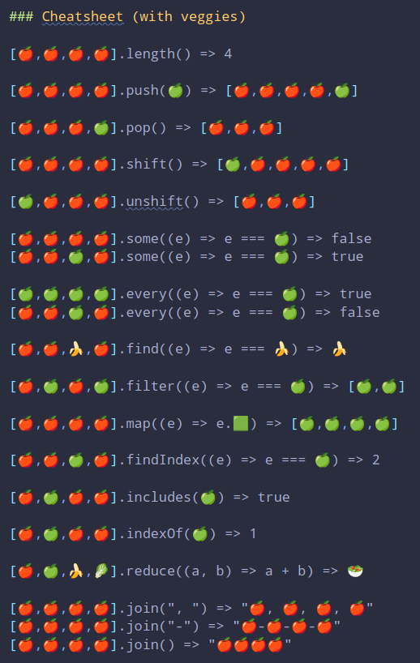

# Functions for Array methods

Crea un modulo con funciones que repliquen los siguientes métodos de array,
sin utilizar ninguno de los métodos o propiedades ya existentes en el prototipo, :

- length,
- push,
- pop (puede usar length),
- unshift,
- shift (puede usar length),
- some,
- every,
- find,
- filter,
- map,
- findIndex,
- includes,
- indexOf,
- reduce,
- join

Cualquiera de tus funciones puede usar las que ya hayas creado.
​

## Testea TODOS los métodos con jest

cada uno antes de continuar con el siguiente

- Creamos proyecto incluido ESLint (xo), prettier y jest
- Creamos el repo, protegemos la rama y añadimos husky
- Creamos la rama de trabajo:
- Mergeamos con PR